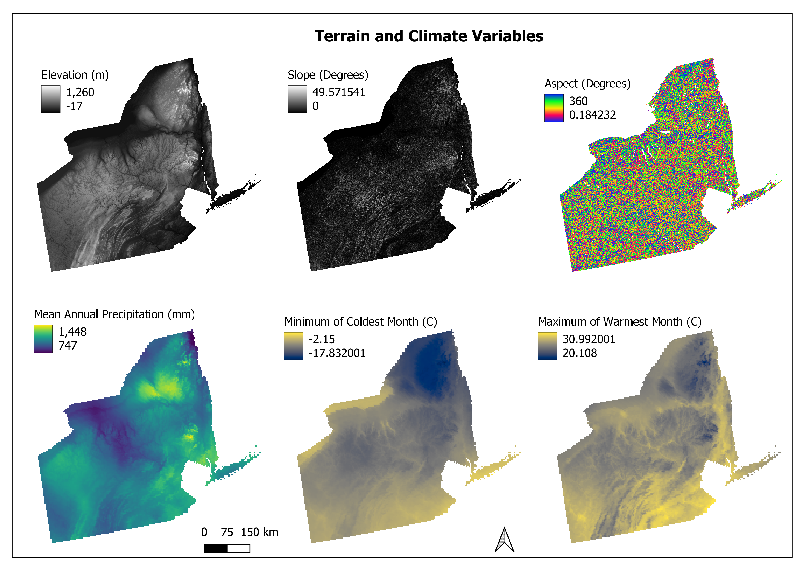
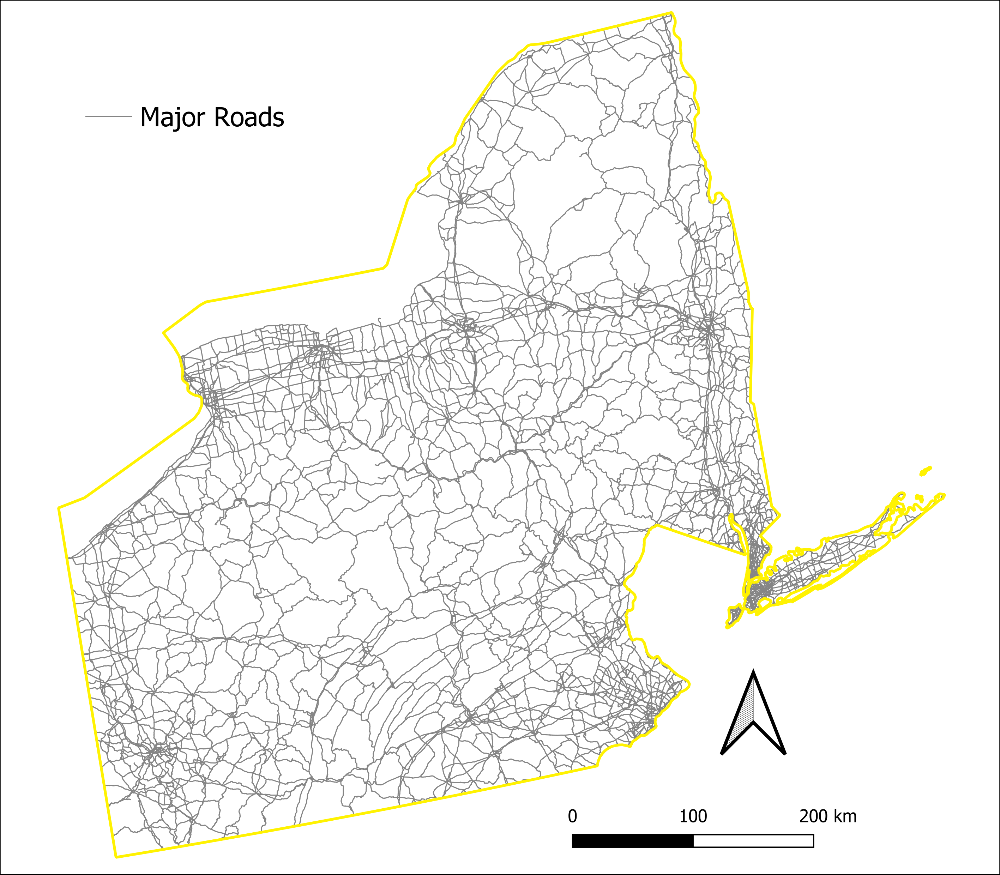
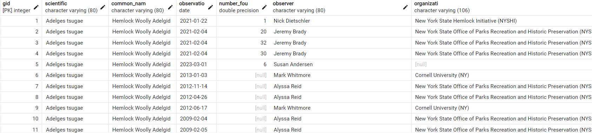
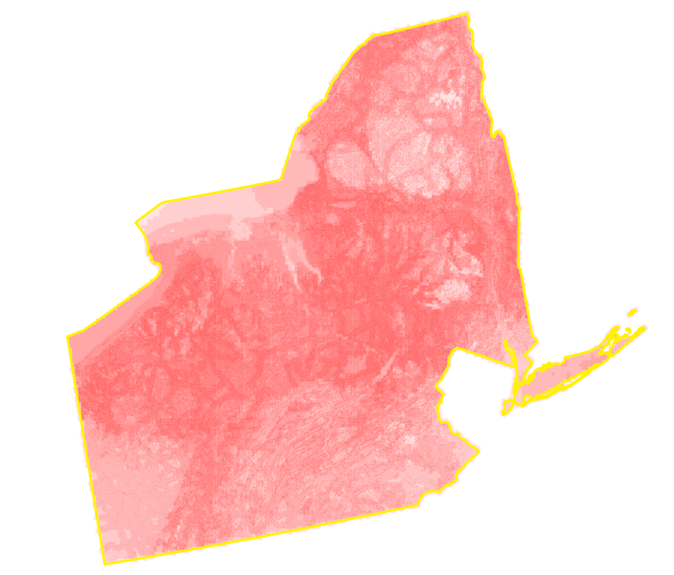

# Identifying Conditions of Hemlock Woolly Adelgid in Northeastern US

_Adlai Nelson_

## Introduction

Hemlock Woolly Adelgid (HWA, _Adelges tsugae_) is a host specific invasive species whose hosts include hemlock species. 
Eastern hemlock (_Tsuga Canadensis_) are particularly important to riparian ecosystems in the Northeast US. 
HWA has spread rapidly since it’s introduction to the US in the 1950s, where it is known to cause mortality in Eastern Hemlock.

This research project aims to answer the following questions:

_What are the environmental and physical conditions that HWA thrives in?_

_What currently uninfested stands of Eastern hemlock are vulnerable to HWA?_

To answer these questions, I will use the case study of two states: Pennsylvania and New York


_Hemlock Woolly Adelgid ovisacs appear as small woolly masses at the base of needles_


## Data


The study area includes the states of Pennsylvania and New York. This is due to data availability.
imapinvasives.net partners with agencies in states to record observations, and these two states are two of the few states that have this partenership.


| Layer Name                 | Data type            | Resolution      | Date      | Source              | Notes                                                                 |
|----------------------------|----------------------|-----------------|-----------|---------------------|-----------------------------------------------------------------------|
| Presence of HWA            | point, polygon, line |       n/a       | 2024      | imapinvasives.net   |    Presence of HWA confirmed by state agencies                                       |
| NY and PA                  | polygon              |       n/a       | 2024      | Natural Earth       |      Study Area                                                       |
| NY and PA roads            | line                 |          n/a    |  2024     | Natural Earth       |  Major Roads                                                          |
| Eastern Hemlock Basal Area | raster image         | 250 m           | 2000-2009 | Barry et al. (2013) | square feet per acre                                                      |
| Temperature                | raster images        | 2.5 arc minutes | 1970-2000 | WorldClim           | max temperature of warmest month and min temperature of coldest month |
| Terrain Products           | raster images       | 90 meters       | 2013      | SRTM                | Slope, Aspect, Elevation                                              |
| Annual Rainfall            | raster images        | 2.5 arc minutes | 1970-2000 | WorldClim           | Mean rainfall (mm)                                                    |

Terrain varibales included are elevation, slope, aspect. These will be used to asses if there is a relationship between HWA infestations and these variables. 
These data were created from a DEM from SRTM, imported with the opentopography extension for QGIS.
Environmental variables include the mean annual rainfall, minimum temperature of coldest month and maximum temperature of the warmest month. 
These datasets all come from WoldClim, and are long term averages over 30 years. 






### Preprocessing


All spatial data preprocessing took place is QGIS 3.28.14.
All layers were reprojected to EPSG 5070, NAD 83 Conus Albers, using reproject and warp (reproject) tools. 
All layers were clipped to the study area, using the clip and clip raster by mask layer tools.
The HWA observations layer was distributed as three seperate layers: points, lines, and polygons. 
To combine these datasets, the centroid tool was used to calculate the centroid of each line and polygon feature.
The resultant features were merged with the points layer, to create a layer containing all observations in point form.

Data was then exported to .sql files using the shp2pgsql and raster2pgsql utilities (see submissions/importing_commands.txt).
The subsequent sql files were then read into a postgis enabled psql database.

```
raster2pgsql -s 5070 -I -C -M data\data_layers\elevation.tif public.elevation > read_data\elevation.sql
psql -U postgres -d HWA_db -f big_files\elevation.sql
```

The slope and aspect images were imported using the `-t 100x100` tag to tile the raster image

### Normalization

This project relies heavily on images, so the majority of the tables will be raster tables, and will not require normalization.
The vector layers that are included in this project: roads and HWA observations were already in 1NF, as all entries were atomic, were of the same datatype, were stored indipendant of order, and each column has a unique name. Both columns also have only one primary key (gid) so they are also 2NF compliant. 
I decided to not normalize any further and remain at 2NF, as the attributes stored in these tables are unimportant to my analysis, I am only really interested in their locations, so I do not need to normalize further.





## Methods

The goal was to find the value of each raster layer at each point where HWA was observed. To this, the postgis function ST_Value was used.

```
SELECT joined.gid, ST_Value(rast, joined.geom) AS high_temp
FROM high_temp CROSS JOIN hwa_points AS joined;
```

The slope and aspect rasters were especially difficult, as running this query using those images resulted in PGAdmin to crash repeatedly. 
Because the output was needed to be in a csv format, the query could not be run in the command line interface. 
Ultimately, the raster layers were loaded into QGIS using the data source manager, and the raster values at HWA points were extracted using the 'sample raster values' tool. 
This also had the advantage than working much faster than the postGIS query, as the query took ~30 minutes in postGIS and only 3-5 seconds in QGIS.


Calculating the distance from nearest road required a slightly more complicated query:

```
SELECT
  points.gid,
  closest_road.gid,
  closest_road.dist
FROM hwa_points AS points
CROSS JOIN LATERAL
  (SELECT
     gid, -- road gid
     ST_Distance(road.geom, points.geom) as dist
     FROM roads AS road 
     ORDER BY points.geom <-> road.geom
   LIMIT 1) AS closest_road; 
```

With these values extracted, they were exported as csv and imported into R, 
where the R statistics package was used to find the mean and standard deviation of each dataset, and ggplot2 was used to create visualizations of the datasets.
With the mean and standard deviation calculated, the ideal conditions for HWA were calculated (within 1 sd of the mean) and new columns were created using ST_DumpAsPolygons. 

```
CREATE TABLE lowtemp_area
AS
SELECT val, geom
FROM (
SELECT poly.*
FROM low_temp, LATERAL ST_DumpAsPolygons(rast) AS poly
) As item
WHERE val BETWEEN -11.725 and -9.098477
ORDER BY val;

```

For distance to roads, the buffer function was used instead.
The database was connected to QGIS, and these layers were used to create visualations of the ideal contions. 


## Results



## Repo Contents

- Submissions folder
  * outline (submission 1)
  * importing commands (contains code to be ran in command line to read datasets into sql code)
-  read_data (contains .sql files to read into psql)
-  figures (contains figures in read me)

### Citations

iMapInvasives: NatureServe’s online data system supporting strategic invasive species management. © [2024], NatureServe. Available at http://www.imapinvasives.org. (Date accessed: [01,04,2024].)

NASA Shuttle Radar Topography Mission (SRTM)(2013). Shuttle Radar Topography Mission (SRTM) Global. Distributed by OpenTopography. https://doi.org/10.5069/G9445JDF. Accessed: 2024-04-11 

Wilson, Barry Tyler; Lister, Andrew J.; Riemann, Rachel I.; Griffith, Douglas M. 2013. Live tree species basal area of the contiguous United States (2000-2009). Newtown Square, PA: USDA Forest Service, Rocky Mountain Research Station. https://doi.org/10.2737/RDS-2013-0013

Fick, S.E. and R.J. Hijmans, 2017. WorldClim 2: new 1km spatial resolution climate surfaces for global land areas. International Journal of Climatology 37 (12): 4302-4315. 
