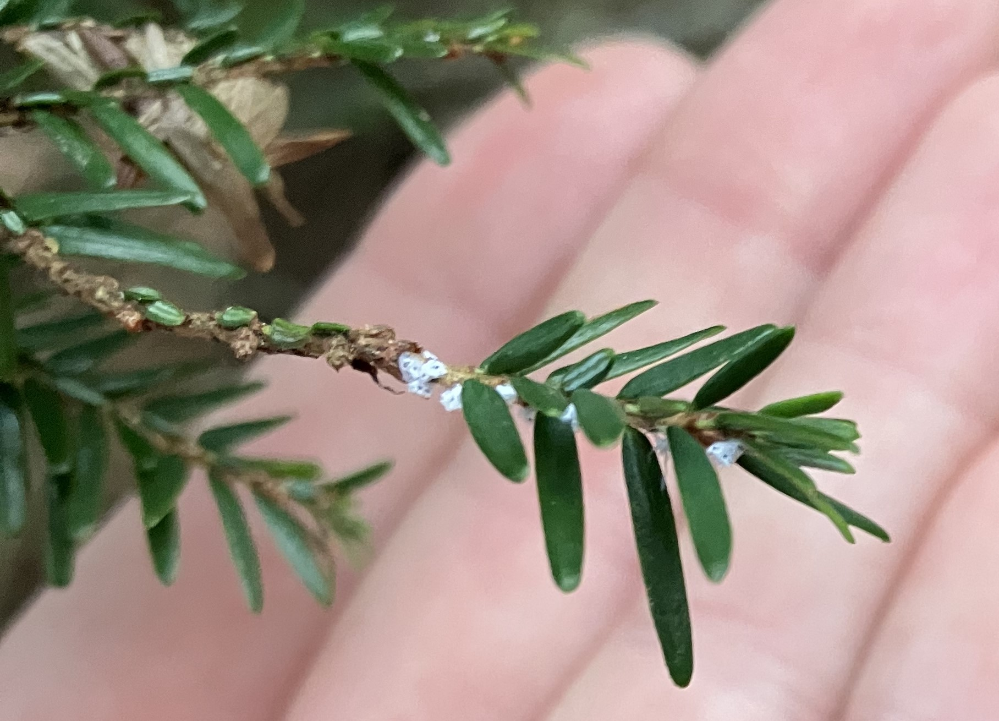

# Identifying Conditions of Hemlock Woolly Adelgid in Northeastern US

_Adlai Nelson_

## Contents

- Submissions folder
  * contains outline

## Introduction

Hemlock Woolly Adelgid (HWA, _Adelges tsugae_) is a host specific invasive species whose hosts include hemlock species. 
Eastern hemlock (_Tsuga Canadensis_) are particularly important to riparian ecosystems in the Northeast US. 
HWA has spread rapidly since it’s introduction to the US in the 1950s, where it is known to cause mortality in Eastern Hemlock.

This research project aims to answer the following questions:

_What are the environmental and physical conditions that HWA thrives in?_

_What currently uninfested stands of Eastern hemlock are vulnerable to HWA?_

To answer these questions, I will use the case study of two states: Pennsylvania and New York

_Hemlock Woolly Adelgid ovisacs appear as small wooley masses at the base of needles_

## Data

| Layer Name                 | Data type            | Resolution | Source                      | Notes                                        |
|----------------------------|----------------------|--------|-----------------------------|----------------------------------------------|
| Presence of HWA            | point, polygon, line | .shp   | imapinvasives.net           |                                              |
| NY and PA polygons         | polygon              | .shp   | Natural Earth               |                                              |
| NY and PA roads            | line                 | .shp   | tbd (natural earth? OSM)    |                                              |
| Eastern Hemlock Basal Area | raster image         | 250 m   | Barry et al., 2013          | square feet per acre                       |
| Temperature                | raster image         | .tif   | NASA- MODIS                 | MODIS, mean of warmest and coldest months    |
| Terrain Products           | images               | .tif   | SRTM via OpenTopography.org | Slope, Aspect                                |
| Annual Rainfall            | raster               | .tif   | NOAA                        |                                              |
